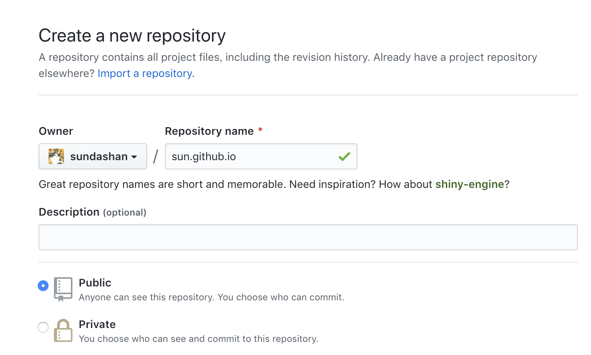
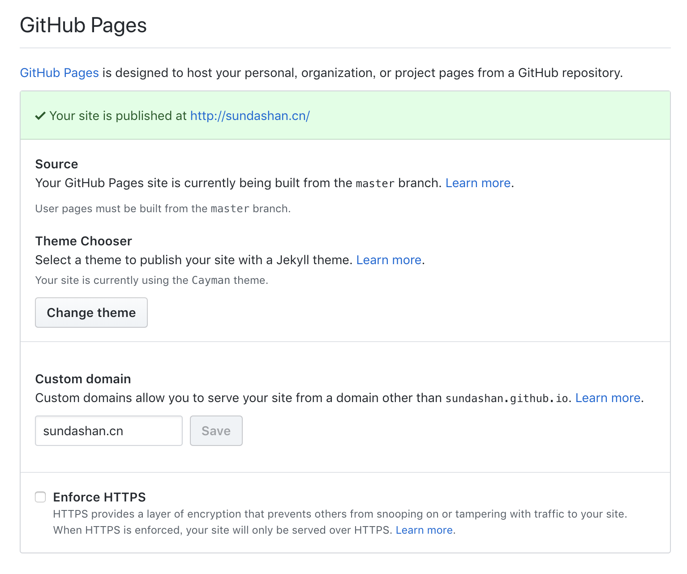
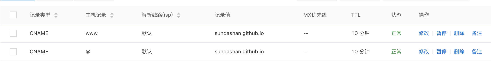

老早之前用wordpress做的，那个使用起来也比较麻烦不轻便，刚好域名过期了，重新弄一个

### 1. hexo新建一个博客
<!-- more -->

```
地址：https://github.com/hexojs/hexo
```

按照readme做一遍就好

新增一篇文章：hexo new 'aaa'

本地预览： hexo s

### 2. 默认的主题不好看，更换主题，我选的是next，比较简洁
```
地址：https://github.com/theme-next/hexo-theme-next
```

```
cd hexo
git clone https://github.com/theme-next/hexo-theme-next themes/next
```
然后修改_config.yml文件中的theme为next

```bash
# Extensions
## Plugins: https://hexo.io/plugins/
## Themes: https://hexo.io/themes/
theme: next
```

或者使用hexo网站中的theme，例如 选择Clover，
在下列文件https://sourcegraph.com/github.com/hexojs/site/-/blob/source/_data/themes.yml#L2507中找到
```bash
  name: Clover
  description: A real simple theme
  link: https://github.com/esappear/hexo-theme-clover
  preview: https://clovertuan.github.io/
```
打开link链接，git clone,照着此项目的介绍继续，然后就好啦

### 3. github建一个github.io的项目


_config.yml中的最后几行修改如下，这边填写自己的github.io地址

```
deploy:
  type: git
  repository: https://github.com/xxx/xxx.github.io
  branch: master
```

然后hexo g 生成，hexo d部署到github.io
这时候打开xxx.github.io就是hexo新建的博客啦，下面绑定域名，这一步可有可无，看个人喜好
### 4. github.io自定义域名

点击github.io项目的Settings中，滑动到最底部，在Custom domain中填入你的域名，如果没有出现，可能是因为GitHub Pages没有选择主题

然后项目中应该出现了一个CNAME的文件，如果没有，到source文件夹中新建文件CNAME，没有后缀，里面写上你的域名，保存
去阿里云控制台对域名进行解析，如下，解析需要几分钟


铛铛铛，搞定啦～莫得事了
