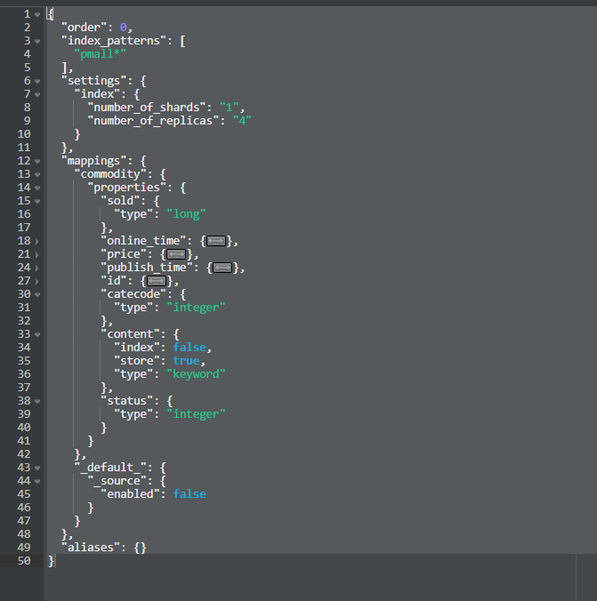

### 1. 创建索引
PUT 请求 http://127.0.0.1:9200/role
其中，put就是新创建，role就是我们创建索引的名字 Index的名字

### 2. 查看全部索引，详细展示
GET http://127.0.0.1:9200/_cat/indices?v
查看全部索引，详细展示

### 3. 添加数据
http://127.0.0.1:9200/role/_doc 索引中添加文档数据 POST可，PUT报错
http://127.0.0.1:9200/role/_doc/1001   自定义id，索引中添加文档数据 POST，PUT均可

### 4. 查询
http://127.0.0.1:9200/role/_doc/1001 GET 查询这一条的信息
http://127.0.0.1:9200/role/_search 查询所有的信息

### 5. 非全量更新：
POST 请求 http://127.0.0.1:9200/role/_update/1001
入参：
```
{
    "doc": {
        "title": "111"
    }
}
```

### 6. 查询
GET http://127.0.0.1:9200/role/_search
```
{
    "query": {
        "match": {
            "role": "admin"
        }
    }
}
```

### 7. 全量查询
GET http://127.0.0.1:9200/role/_search
match_all 查询所有文档
```
{
    "query": {
        "match_all": {

        }
    }
}
```

### 8. 分页查询
GET http://127.0.0.1:9200/role/_search
```
{
    "query": {
        "match_all": {

        }
    },
    "from": 0,
    "size": 2
}
```

### 9. 对想要的数据进行指定查询：
GET http://127.0.0.1:9200/role/_search
_source: 结果只返回一部分字段时，可加上_source
```
{
    "query": {
        "match_all": {

        }
    },
    "from": 0,
    "size": 2,
    "_source": ["title"]
}
```

### 10. 排序：
GET http://127.0.0.1:9200/role/_search
sort 排序: desc降序， asc升序
```
{
    "query": {
        "match_all": {

        }
    },
    "from": 0,
    "size": 2,
    "_source": ["title"],
    "sort": {
        "price": {
            "order": "desc"
        }
    }
}
```

### 11. 多条件同时成立 
```
{
    "query": {
        "bool": {
            "must": [{
                "match": {
                    "role": "admin"
                }
            }, {
                "match": {
                    "desc": "test"
                }
            }]
        }
    }
}
```

### 12. 或者：should

### 13. 范围查询
```
{
    "query": {
        "match_all": {

        }
    },
    "filter": {
        "range": {
            "price": {
                "gt": 5000
            }
        }
    }
}
```

### 14. 完全匹配：
match_phrase

### 15. 聚合查询：
```
{
    "aggs": { // 聚合操作
        "price_group": { // 名称，随意起的
            "terms": { // 分组
                "field": "price" // 分组字段
            },
            "buckets": [
                {
                    "key": 9,
                    "doc_count": 2
                }, {
                    "key": 8,
                    "doc_count": 1
                }
            ]
        }
    }
}
```

### 16. 映射关系
PUT http://127.0.0.1:9200/role/_mapping
```
{
    "properties": {
        "name": {
            "type": "text",
            "index": true
        },
        "sex": {
            "type": "keyword",
            "index": true
        },
        "tel": {
            "type": "keyword",
            "index": false
        },
    }
}
```

### 17. 创建索引模版
PUT   _template/template_1


### 18. 删除索引模板：
DELECT  _template/template_1

### 19. 查看
GET请求   _template/template_1

### 20. 查看多个
GET请求  _template/tem*

### 21. 其他：
term query 会去倒排索引中寻找确切的term，没有分词器，很适合keyword，numeric、date等明确值
查询某个字段里含有某个关键词的文档

terms 查询某个字段里含有多个关键词的文档

match query 知道分词器，会对field进行分词操作

multi_match 可指定多个字段

match_phrase 短语匹配查询

fuzzy 模糊查询

bulk 批量操作

delete_by_query 会删除所有query语句匹配上的文档

must_not 必须不匹配