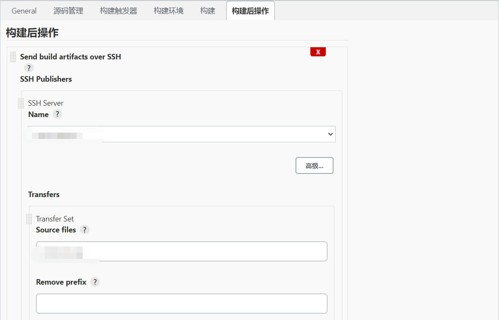

说实话对Jenkins不是很熟，之前一直写的是前端代码，部署也比较简单，写个脚本，提交以后顺手部署一下就好了。
这一篇就，让我们来水一水吧！
## 1. 主界面

左侧：新建一个item、展示构建队列等

中间的列表展示的是构建任务列表，上次成功、上次失败、上次持续时间，最后一个按钮是点击构建

首先，点击左侧的“新建一个item”，创建一个新的构建任务

## 2. 配置
#### 2.1. General
这边没写啥，就写了一个备注：xx发布

#### 2.2. 源码管理
我们项目代码存放在码云上，所以这边选择git，填写项目git地址，指定分支。只有指定的分支有新的提交才会自动部署

#### 2.3. 构建触发器
Poll SCM：配置Jenkins以轮询SCM中的更改--请注意，这是一个昂贵的操作，因为每次轮询都需要Jenkins扫描整个工作区并与服务器进行验证。考虑设置“推”触发器以避免此开销。
其实就是代码仓库发生改动时，Jenkins不知道，需要配置这个，然后去轮询检查是否有新的提交。

#### 2.4. 构建环境

#### 2.5. 构建

#### 2.6. 构建后操作

Source files：源文件，发给远程主机的

Exec command：脚本

